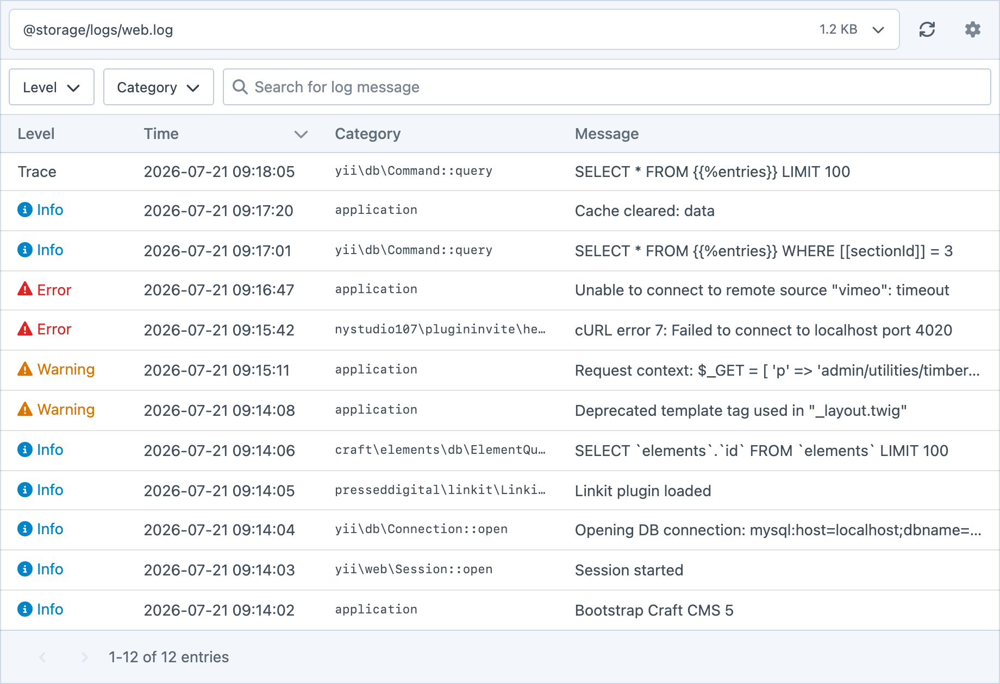

# Logs

Timber lets you inspect Craft's log files from the control panel. Choose a file, filter its entries and expand a message to see the details recorded with it.

## Log Screen

The Timber log screen is the interface for viewing logs. It's built as a Craft Utility, to sit alongside other similar tools.

The interface allows you to pick a log file and see its size. Once picked, you'll see a table of all log entries for the file which are sortable, filterable and searchable. For example, almost all log files record a "level", which represent the type of error it is (info, warning, error). Some other log files also contain "category" information, which is often used by plugins to scope logs to certain plugins or services.

The log file picker is a searchable combobox — useful when `storage/logs` has many dated or plugin files.

Clicking on a log entry will expand the detail of that log with any context also captured with the log.

You can also download single files or all visible files. Delete actions are available for top-level files in `@storage/logs`; nested and event-added external files remain viewable and downloadable.

Log entries are also paginated for performance.

## Log Discovery

Timber scans Craft’s `@storage/logs` directory for:

- `*.log` and dated Craft files such as `web-2026-08-19.log`
- Rotations such as `web.log.1` and dated logrotate suffixes
- Compressed `*.gz` copies of the above
- Plain `*.txt` / `*.txt.*` logs some tools write alongside `.log` files

Permissions and include/exclude config use a **stem** — the base name without date or rotation suffixes. So `web-2026-08-19.log`, `web.log.1`, and `web.log.1.gz` all share the `web` stem.

Real-time watching is limited to active `.log` files; see [Real-Time Logs](docs:feature-tour/real-time-logs).

## Permissions

Timber provides User permissions for certain features. Non-admin users need access to the Logs utility and either **View all log files** or a file-specific log permission to view logs. You can also control who can download or delete log files with separate permissions.

To restrict **which** log files a user group can see, leave **View all log files** unchecked and enable the file-specific permissions for specific files (`web`, `queue`, `phperrors`, and any plugin logs currently on disk). Dated files like `web-2026-08-19.log` are grouped under `web`. Users with **View all log files** continue to see new log files as they appear.

:::warning
A non-admin user with neither **View all log files** nor a file-specific log permission cannot see any logs, even when they have access to the Logs utility. Grant only the file permissions the group needs.
:::

You can also limit the catalogue for the whole site via `includedLogFiles` / `excludedLogFiles` in `config/timber.php` (or Settings → Timber). Config applies first; user permissions then filter further. Download all / delete all only affect files the user is allowed to see.

Modules can add or remove files from the catalogue with the `modifyLogFiles` event. See [Events](/developers/events).

## Performance

For a large log, the utility may show only part of the file. Check the timestamps of the displayed entries before concluding that an event was not recorded. Download the file when you need to inspect its complete history.

The following limits keep viewing and downloading logs manageable:

- Log files are read line by line rather than loaded entirely into memory.
- At most 100,000 entries are retained per file: the newest entries for plain logs, or the oldest entries for gzip archives.
- Parsed windows up to 8 MiB are cached until the file changes. Larger windows are read directly to avoid duplicating their parsed data in memory. For gzip archives, cache eligibility uses `maxLogReadBytes` because compressed file size does not indicate the size of the parsed data.
- Results are paginated, with a configurable page size and an independent maximum.
- An uncompressed file larger than `maxLogReadBytes` is parsed from a tail window instead of from its beginning. The default window is 50 MiB.
- Download all is limited to 250 visible files and 1 GiB of source data per archive.

When a file uses the tail window, older entries outside that window do not appear in Timber. Download the file or use server-side log tooling when you need its complete history. Gzip archives are read from the beginning and stop after the same uncompressed byte budget, so newer entries outside that window are omitted. Rotate logs regularly to keep individual files manageable.
