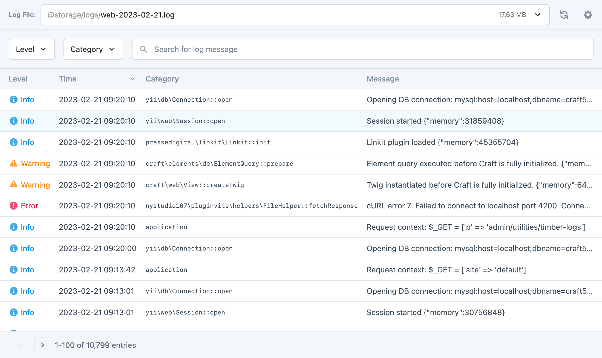
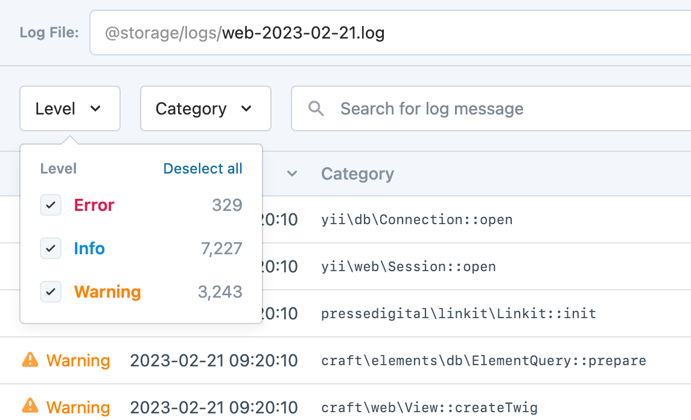

<!-- feature-intro -->
A utility for viewing and working with your application logs in the Craft control panel.
<!-- feature-intro-end -->

<!-- feature-section media-size="large" -->
## Beautiful and performant

Wrangle your Craft web, queue, PHP and third-party logs — even massive ones — without feeling it would be easier to read them raw. Timber brings them into one interface that looks great and stays responsive, saving time when you need to find out what happened.

<!-- feature-section-end -->

<!-- feature-media -->
## Filtering, sorting and searching

It would not be a useful interface for diving into log files without filters for levels and categories, useful sorting, and full-text search. Timber gives you all three, so the useful line is easier to find.

<!-- feature-media-end -->

<!-- feature-grid -->
- :icon[activity] **Real-time logging** Sit back with a coffee and watch new entries arrive when the server supports the required tools.
- :icon[download] **Download logs** Save one file or collect all available logs into a ZIP without reaching for server access.
- :icon[trash] **Delete logs** Clear old files through a separately permissioned control-panel action.
<!-- feature-grid-end -->
